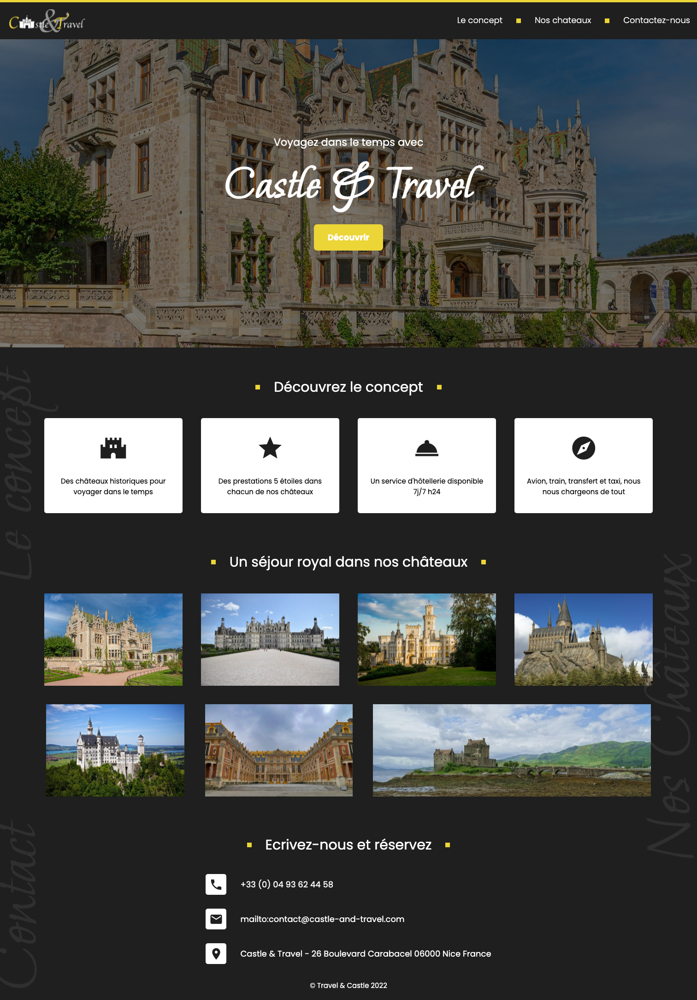
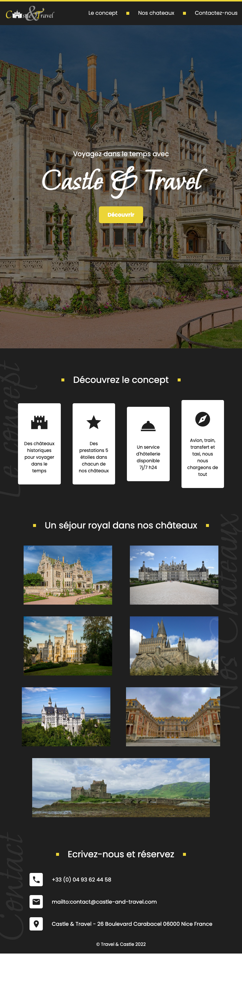
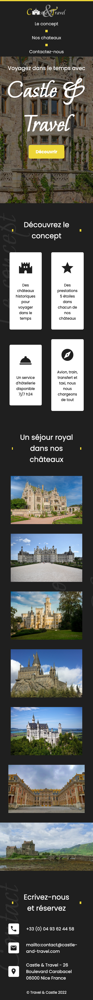

# Exercice 1: Castle & Travel 🏰

## Le Sujet

Pour cet exercice, tu dois intégrer un site web sur la base des maquettes ci-dessous. Pour cela, complète les fichiers **index.html** et **style.css**.

Les ressources nécessaires comme les images ou les polices sont déjà présentes dans le dossier "assets" (il te suffit de les utiliser).

Les icones sont déjà importées depuis Material Icons dans le fichier HTML. Pour les utiliser, tu peux consulter la [librairie d'icônes](https://fonts.google.com/icons).

Attention, ton site web devra être _responsive_ pour s'adapter aux différentes résolutions d'écrans conformément aux maquettes.

### Charte de couleurs

&nbsp;#ecd537&nbsp; &nbsp;#1f1f1f&nbsp;

### Maquette 1512x753 (Ordinateur portable)

### Maquette 820x1180 (Tablette)

### Maquette 390x844 (Smartphone)

